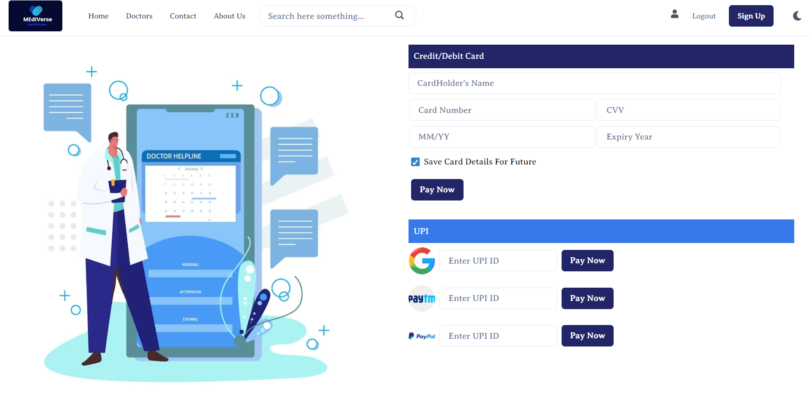

# MEdiVerse.com
This was an individual project made by me and executed within the span of 5 days. I did this project in our unit-4 construct week.

## Tech Stack 
* React js
* Chakra UI
* Animate.css
* React-Router-Dom

## Logo 

.png)

# LandingPage

## Features
* Home Page
* Login and Registration
* Booking
* Patients Details with appointment details
* Pagination
* Searching
* Payment
* Authentication

MEdiVerse  is an online booking appointment website where user or patient can book their appointment digitally with the doctor they want to visit.A website where patients connect with their potential doctors.
If you have an extensive database, doctors might find it difficult to search through all those profiles.
That’s where a search option can be helpful. It allows patients to filter the profiles by desired doctor ratings, and more.

Once a patient chooses a physician, they should be able to easily navigate available appointment dates and time slots. The fewer steps it takes to book a visit, the better.
<!--  -->
After filling form patient will redirect to payment page and there different online payment methods are available.

##### After Successfully Payment there is modal present which shows thank you!

The Website is fully responsive.

Website contains both light mode and dark mode which user can use accordingly what they like.
Light Mode Image

Dark Mode Image

There is also footer present where you can get information about us and also patients can connect with us on different social platforms.

